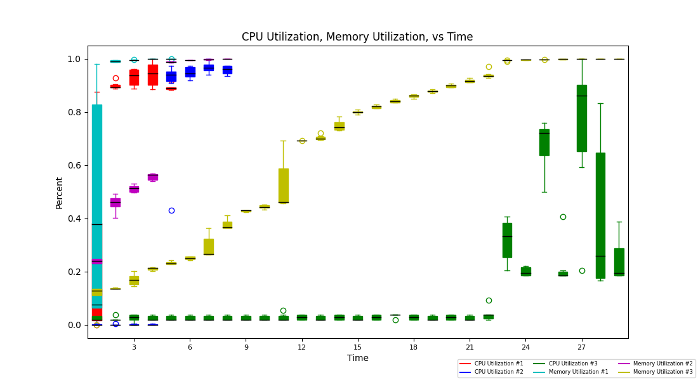

User can choose up to 3 files to graph at once. User can choose which columns from files along with which selected files to graph with checkboxes if in pre-defined format.

Example Graph:

Built with TKinter library on the front-end and python + pandas on the backend. 
